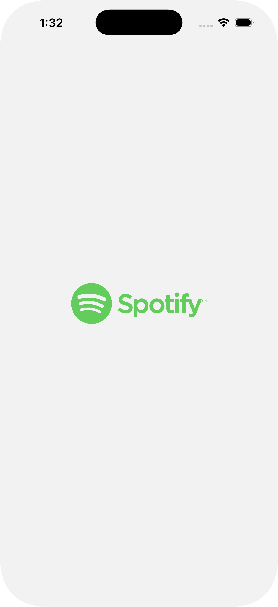
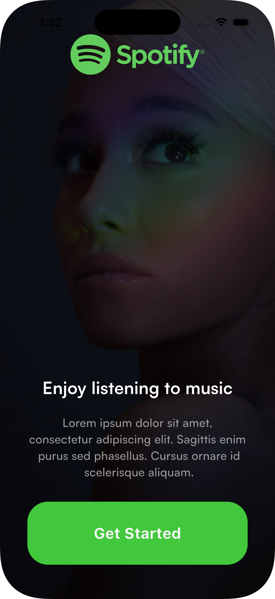
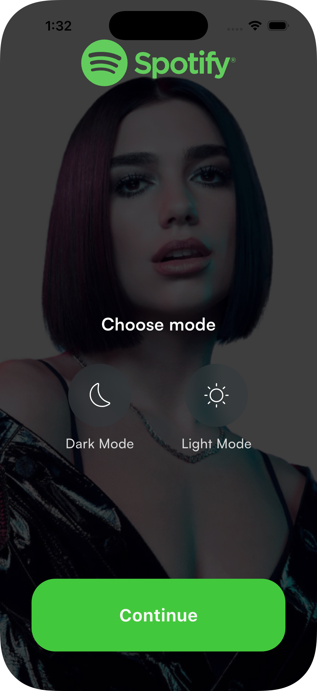
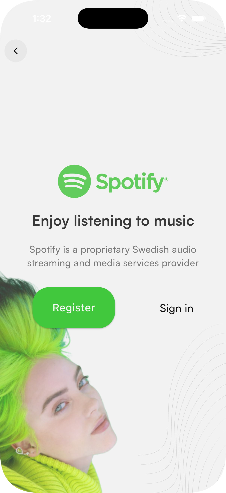
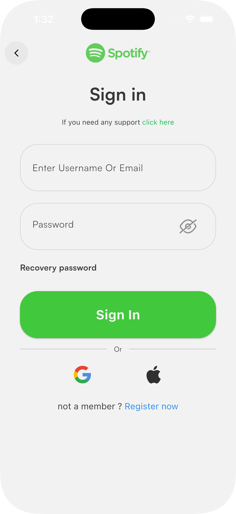
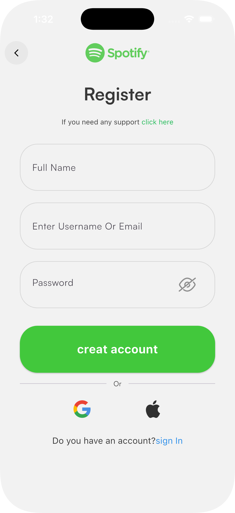
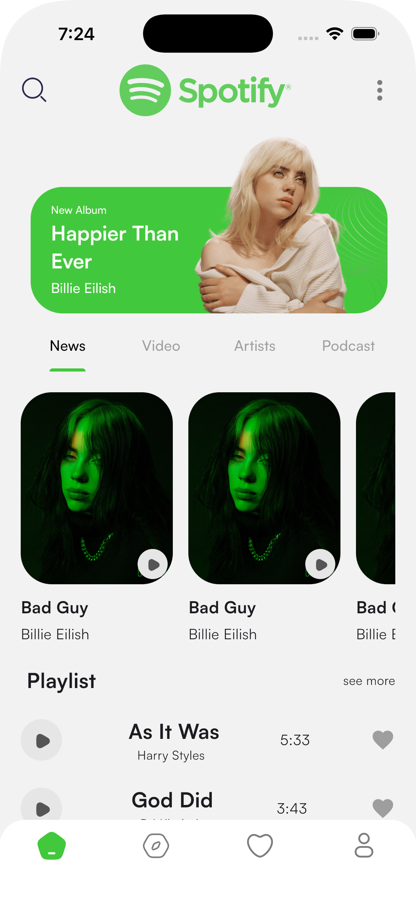

# Spotify Clone 🎧

A Spotify UI clone built with **Flutter** — from on-boarding and theme selection to the main home experience. The app follows a clean **feature-based architecture** with BLoC state management, a custom typography (**Satoshi** font family), and a fully responsive dark/light design.

---

## ✨ Features

### 🚀 Flow
- **Splash screen** with animated logo navigation
- **Intro screen** with "Get Started"
- **Choose your mode** — dark / light theme selection persisted via `hydrated_bloc`
- **Register / Sign-in landing page**
- **Login** and **Register** screens wired into the main shell after sign-in

### 🎨 Theme
- Dark / Light toggle managed by `ThemeCubit` with sealed `ThemeState` classes (`ThemeInitial`, `ThemeUpdated`)
- Theme choice is persisted across app restarts
- All screens react to the selected theme through `Theme.of(context)`

### 🔐 Authentication screens
- Form validation on login/register
- Show / hide password toggle (custom `Hide.png` icon)
- "Recovery password" action row
- Social sign-in buttons (Google / Apple)

### 🏠 Home
- Header row (search icon, Spotify logo, more menu) + hero banner image
- Tab bar with 4 tabs: **News · Video · Artists · Podcast**
- **News tab** contains a horizontal `NewsContainer` carousel (rounded card, play button overlay) and a "Playlist / see more" section with song rows (play button, title/artist, duration, favorite icon)
- Placeholder content for the other tabs

### 📱 Bottom navigation bar
- White container with **rounded top corners** and safe-area padding
- 4 custom **SVG icons** (no surrounding shapes):  
  `home_nav.svg` · `٢.svg` (compass) · `Heart 1.svg` · `Profile 1.svg`
- Uniform icon size of **24×24**
- Active tab tinted Spotify green `#42C83C`, inactive gray `#7D7D7D`
- Screens kept alive with `IndexedStack` inside `RootScreen` (Home / Search / Library / Profile)

### 🧩 Reusable widgets (`lib/common/widgets`)
- `BasicAppBar` — theme-aware `PreferredSizeWidget` with back button
- `BasicAppButton` — primary button with optional `width` / `textStyle`
- `TexFormField` — text field with controller, icons, obscure text, validator
- `BottomNavBar` — custom bottom navigation bar

---

## 📸 Screenshots

| | | |
|:-:|:-:|:-:|
| Splash | Intro | Choose Mode |
|  |  |  |
| Register / Sign in | Login | Login (with password) |
|  |  |  |
| Home |||
|  |||

---

## 🛠️ Tech Stack

| Package | Purpose |
|---------|---------|
| [Flutter](https://flutter.dev) | UI framework (SDK `^3.12.0`) |
| [flutter_bloc](https://pub.dev/packages/flutter_bloc) `^9.1.1` | State management |
| [hydrated_bloc](https://pub.dev/packages/hydrated_bloc) `^11.0.0` | Persisted (hydrated) state — theme |
| [flutter_svg](https://pub.dev/packages/flutter_svg) `^2.3.0` | SVG vector rendering |
| [path_provider](https://pub.dev/packages/path_provider) `^2.1.6` | Local storage path for hydration |
| flutter_lints `^6.0.0` | Lint rules (dev) |

**Typography:** [Satoshi](https://www.fontshare.com/fonts/satoshi) — Black / Bold / Medium / Regular / Light (bundled in `assets/fonts/`).

---

## 📁 Project Structure

```
lib/
├── main.dart
├── core/
│   └── config/
│       ├── assets/
│       │   ├── app_images.dart
│       │   └── app_vectors.dart
│       └── theme/
│           ├── app_colors.dart
│           └── app_theme.dart
├── common/
│   └── widgets/
│       ├── appBar/basic_app_bar.dart
│       ├── bottom_nav/bottom_nav_bar.dart
│       ├── button/app_primary_button.dart
│       └── textform/tex_form_field.dart
└── presentation/
    ├── splash/pages/splash.dart
    ├── intro/pages/intro_screen.dart
    ├── choose_theme/
    │   ├── pages/choose_mode.dart
    │   └── logic/cubit/
    │       ├── theme_cubit.dart
    │       └── theme_state.dart
    ├── auth/
    │   ├── register_or_signin/pages/register_or_sign.dart
    │   ├── login/pages/login_screen.dart
    │   └── register/pages/register_screeen.dart
    ├── home/
    │   ├── pages/home_screen.dart
    │   └── widgets/news_continer.dart
    └── main/pages/root_screen.dart
```

Each feature owns its `pages`, `widgets`, and `logic/cubit` folders — shared code lives in `common/`, configuration in `core/`.

---

## 🧭 App Flow

```
Splash → Intro → Choose Mode → Register / Sign in ─┬→ Login        ─┐
                                                   └→ Register    ─┴→ RootScreen
                                                                          │
                                    ┌─────────────┬─────────────┬────────┘
                                    ▼             ▼             ▼
                                  Home        Search        Library      Profile
                              (TabBar: News / Video / Artists / Podcast)
```

---

## 🚀 Getting Started

**Prerequisites:** [Flutter](https://docs.flutter.dev/get-started/install) installed and a device/emulator available (`flutter doctor`).

1. Clone the repository:

```bash
git clone https://github.com/Sohib-Emad/spotify_clone.git
cd spotify_clone
```

2. Install dependencies:

```bash
flutter pub get
```

3. Run the app:

```bash
flutter run
```

---

## 📄 License

This project is for learning/educational purposes only.
